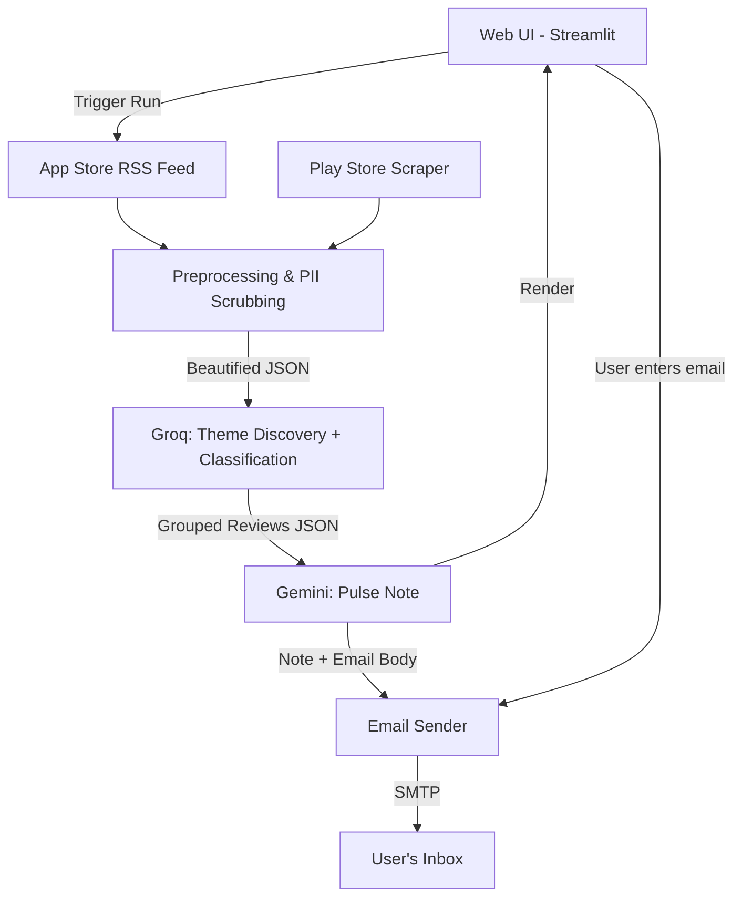

# Indmoney Weekly App Review Insights — Architecture

## 🏗️ System Overview

A five-phase pipeline: scrape public reviews → extract themes (Groq) → generate pulse note (Gemini) → email delivery → **web UI to orchestrate everything**.



---

## 📅 Phase 1 — Data Extraction & Preprocessing ✅

**Folder:** `phase1_scraper/` • **Entry point:** `run_phase1.py`

| Step | Detail |
|------|--------|
| Play Store | `google-play-scraper` with package ID **`in.indwealth`**. Paginates up to 5 batches × 200 reviews, tries `NEWEST` then `MOST_RELEVANT` sort. |
| App Store | **Apple RSS JSON feed** for app ID **`1450178837`**. Paginates 10 pages (~500 reviews). |
| Filter | Keep reviews from last 8–12 weeks (configurable `--weeks`). |
| Clean | Extract `Rating`, `Text`, `Date`, `Source`. **Title removed.** Reviews < 5 words filtered. PII scrubbed via Regex. |
| Dedup | Deduplicate by text, sort newest-first, cap at **200 per store**. |
| Output | `playstore_reviews.json`, `appstore_reviews.json`, `reviews_sample.json` — each with metadata header. |
| Safety | Empty scrape results never overwrite existing data. |

---

## 🧠 Phase 2 — Theme Discovery & Classification (Groq) ✅

**Folder:** `phase2_themes/` • **Entry point:** `run_phase2.py` • **Model:** Llama-3.3 70B

Two-step pipeline designed for Groq free tier (12K TPM limit):

### Step 2a — Theme Discovery (1 API call)
- **Input:** Stratified sample of ~120 reviews (balanced across ★1–★5).
- **Prompt:** Identify exactly 3–5 distinct, actionable themes.
- **Output:** JSON array of `{id, label, description}`.
- **Caching:** Themes saved to `themes-YYYY-MM-DD.json`; re-runs skip discovery.

### Step 2b — Review Classification (~4 API calls)
- **Input:** All 299 reviews + themes from 2a.
- **Batching:** 75 reviews per call (~8K tokens, under 12K TPM limit).
- **Cooldown:** 65s between batches (TPM resets every 60s).
- **Retry:** On HTTP 429, wait 65s and retry (up to 3 times).
- **Unclassified fallback:** Any unmatched reviews assigned to the largest theme.
- **Result:** 299/299 reviews classified (0 unclassified).

### Themes Identified
| Theme | Reviews |
|-------|---------|
| App Functionality & Features | 149 |
| User Interface Issues | 48 |
| Transaction & Withdrawal Problems | 42 |
| Investment Tracking & Portfolio Mgmt | 32 |
| Customer Support & Service | 28 |

**Output:** `grouped_reviews-YYYY-MM-DD.json`, `themes.json`

---

## 🤖 Phase 3 — Weekly Pulse Note (Gemini)

**Folder:** `phase3_pulse/` • **Model:** Gemini 2.0 Flash

**Goal:** Convert grouped themes JSON into a ≤ 250-word pulse note + email body.

### Prompt

```text
You are the Lead Product Manager for "INDmoney".
Given JSON with grouped themes and quotes, generate:

1. **Weekly Pulse Note** (≤ 250 words, Markdown):
   • Top themes with review counts
   • 3 real user quotes (verbatim)
   • 3 actionable recommendations

2. **Email Body** (HTML):
   • Subject line
   • Brief intro + inline pulse content + sign-off

Constraints: Only use provided data. 0% PII. Scannable bullets.
```

---

## 📨 Phase 4 — Email Delivery

**Goal:** Send the pulse note to a user-provided email via SMTP.

| Step | Detail |
|------|--------|
| Input | Email address from the **Web UI** (or CLI fallback). |
| Compose | `email.mime` — subject & body from Gemini output. Optionally attach `.md`/`.pdf`. |
| Send | `smtplib` SMTP/TLS (Gmail App Password or any relay). |
| Fallback | Generate `.eml` file if SMTP is unavailable. |

---

## 🖥️ Phase 5 — Web UI (Streamlit)

**Goal:** Browser-based dashboard to trigger the pipeline, preview results, and send emails.

```
┌─────────────────────────────────────────────────┐
│  Indmoney Weekly Review Pulse            [logo] │
├────────────┬────────────────────────────────────┤
│ Config     │  ┌──────────────────────────────┐  │
│            │  │  Reviews Table (preview)     │  │
│ Weeks: [8] │  └──────────────────────────────┘  │
│            │  ┌──────────────────────────────┐  │
│ [Run ▶]    │  │  Themes (expandable cards)   │  │
│            │  └──────────────────────────────┘  │
│            │  ┌──────────────────────────────┐  │
│ Email:     │  │  Weekly Pulse Note (render)  │  │
│ [________] │  │  [Download PDF]              │  │
│ [Send ✉]   │  └──────────────────────────────┘  │
└────────────┴────────────────────────────────────┘
```

---

## 🛠️ Tech Stack

| Layer | Tool |
|-------|------|
| Language | Python 3.9+ |
| Web UI | **Streamlit** |
| Play Store | `google-play-scraper` (`in.indwealth`) |
| App Store | Apple RSS JSON feed (ID: `1450178837`) |
| Data | `pandas` |
| LLMs | `groq` SDK — Llama-3.3 70B (Phase 2) · `google-generativeai` SDK — Gemini (Phase 3) |
| Email | `smtplib` + `email.mime` |
| PDF | `fpdf` or `markdown` |
